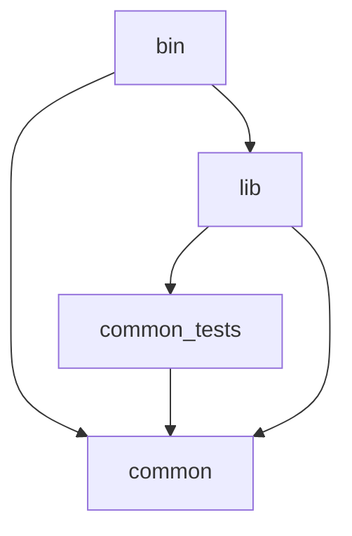

# convertible_couch

Automate Windows display configuration to play from your couch

 
 

## Project Organisation

## TODO
- Switch audio output, usefull ressources:
  - https://github.com/Belphemur/AudioEndPointLibrary
  - https://github.com/Belphemur/SoundSwitch
  - https://github.com/rust-lang/rust-bindgen
  - https://docs.rs/cpp/latest/cpp/
  - https://github.com/rust-qt/ritual
- Refactor display_settings to reduce code duplication

## Acknowledgments
- [Icon Source](https://www.flaticon.com/free-icon/couch_1010398)
